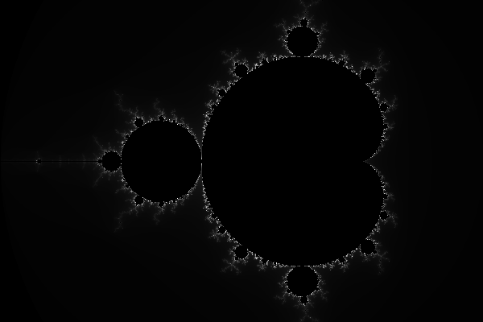
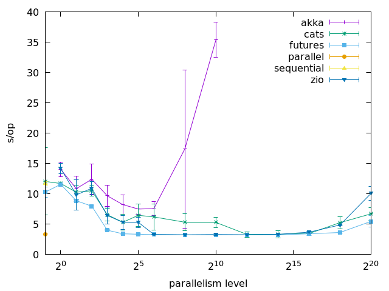

# Mandelbrot #

Benchmarks calculating mandel brot sets using akka, cats, futures or zio.

## Example ##

```
Problem: MandelFrame.forExtract(-2, 1, -1, 1, 200)
Size: 240,000
```



## Benchmarks ##

```
Problem: MandelFrame.forExtract(-2, 1, -1, 1, 1000)
Size: 6,000,000
```



```
Benchmark                                   Mode  Cnt   Score    Error  Units

Actor1MandelSolverBenchmark.benchmark       avgt    5  14.024 ±  1.213   s/op
Actor2MandelSolverBenchmark.benchmark       avgt    5  10.863 ±  2.067   s/op
Actor4MandelSolverBenchmark.benchmark       avgt    5  12.407 ±  2.473   s/op
Actor8MandelSolverBenchmark.benchmark       avgt    5   9.680 ±  1.714   s/op
Actor16MandelSolverBenchmark.benchmark      avgt    5   8.229 ±  1.606   s/op
Actor32MandelSolverBenchmark.benchmark      avgt    5   7.499 ±  0.861   s/op
Actor64MandelSolverBenchmark.benchmark      avgt    5   7.574 ±  1.109   s/op
Actor256MandelSolverBenchmark.benchmark     avgt    5  17.420 ± 13.034   s/op
Actor1024MandelSolverBenchmark.benchmark    avgt    5  35.371 ±  2.907   s/op
Actor65536MandelSolverBenchmark.benchmark

EffectMandelSolverBenchmark.benchmark       avgt    5  12.055 ±  5.558   s/op
Effect1MandelSolverBenchmark.benchmark      avgt    5  11.703 ±  0.164   s/op
Effect2MandelSolverBenchmark.benchmark      avgt    5  10.279 ±  1.154   s/op
Effect4MandelSolverBenchmark.benchmark      avgt    5  10.514 ±  0.925   s/op
Effect8MandelSolverBenchmark.benchmark      avgt    5   6.564 ±  1.068   s/op
Effect16MandelSolverBenchmark.benchmark     avgt    5   5.324 ±  1.272   s/op
Effect32MandelSolverBenchmark.benchmark     avgt    5   6.468 ±  1.853   s/op
Effect64MandelSolverBenchmark.benchmark     avgt    5   6.200 ±  2.171   s/op
Effect256MandelSolverBenchmark.benchmark    avgt    5   5.328 ±  1.366   s/op
Effect1024MandelSolverBenchmark.benchmark   avgt    5   5.292 ±  0.850   s/op
Effect4096MandelSolverBenchmark.benchmark   avgt    5   3.321 ±  0.464   s/op
Effect16384MandelSolverBenchmark.benchmark  avgt    5   3.340 ±  0.569   s/op
Effect65536MandelSolverBenchmark.benchmark  avgt    5   3.467 ±  0.036   s/op

FutureMandelSolverBenchmark.benchmark       avgt    5  10.295 ±  0.830   s/op
Future1MandelSolverBenchmark.benchmark      avgt    5  11.572 ±  0.251   s/op
Future2MandelSolverBenchmark.benchmark      avgt    5   8.866 ±  0.136   s/op
Future4MandelSolverBenchmark.benchmark      avgt    5   7.973 ±  0.098   s/op
Future8MandelSolverBenchmark.benchmark      avgt    5   4.015 ±  0.076   s/op
Future16MandelSolverBenchmark.benchmark     avgt    5   3.423 ±  0.066   s/op
Future32MandelSolverBenchmark.benchmark     avgt    5   3.350 ±  0.042   s/op
Future64MandelSolverBenchmark.benchmark     avgt    5   3.301 ±  0.019   s/op
Future256MandelSolverBenchmark.benchmark    avgt    5   3.237 ±  0.013   s/op
Future1024MandelSolverBenchmark.benchmark   avgt    5   3.242 ±  0.011   s/op
Future4096MandelSolverBenchmark.benchmark   avgt    5   3.249 ±  0.016   s/op
Future16384MandelSolverBenchmark.benchmark  avgt    5   3.273 ±  0.028   s/op
Future65536MandelSolverBenchmark.benchmark  avgt    5   3.415 ±  0.329   s/op

ParallelMandelSolverBenchmark.benchmark     avgt    5   3.361 ±  0.168   s/op

SequentialMandelSolverBenchmark.benchmark   avgt    5  11.690 ±  0.319   s/op

ZioMandelSolverBenchmark.benchmark
Zio1MandelSolverBenchmark.benchmark         avgt    5  14.193 ±  0.830   s/op
Zio2MandelSolverBenchmark.benchmark         avgt    5   9.836 ±  2.543   s/op
Zio4MandelSolverBenchmark.benchmark         avgt    5  10.923 ±  1.097   s/op
Zio8MandelSolverBenchmark.benchmark         avgt    5   6.446 ±  1.403   s/op
Zio16MandelSolverBenchmark.benchmark        avgt    5   5.309 ±  1.171   s/op
Zio32MandelSolverBenchmark.benchmark        avgt    5   5.307 ±  0.827   s/op
Zio64MandelSolverBenchmark.benchmark        avgt    5   3.319 ±  0.046   s/op
Zio256MandelSolverBenchmark.benchmark       avgt    5   3.256 ±  0.024   s/op
Zio1024MandelSolverBenchmark.benchmark      avgt    5   3.303 ±  0.121   s/op
Zio4096MandelSolverBenchmark.benchmark      avgt    5   3.263 ±  0.018   s/op
Zio16384MandelSolverBenchmark.benchmark     avgt    5   3.339 ±  0.042   s/op
Zio65536MandelSolverBenchmark.benchmark     avgt    5   3.688 ±  0.194   s/op
```

## License ##

MIT License

Copyright (c) 2020 Jan Meyer

Permission is hereby granted, free of charge, to any person obtaining a copy
of this software and associated documentation files (the "Software"), to deal
in the Software without restriction, including without limitation the rights
to use, copy, modify, merge, publish, distribute, sublicense, and/or sell
copies of the Software, and to permit persons to whom the Software is
furnished to do so, subject to the following conditions:

The above copyright notice and this permission notice shall be included in all
copies or substantial portions of the Software.

THE SOFTWARE IS PROVIDED "AS IS", WITHOUT WARRANTY OF ANY KIND, EXPRESS OR
IMPLIED, INCLUDING BUT NOT LIMITED TO THE WARRANTIES OF MERCHANTABILITY,
FITNESS FOR A PARTICULAR PURPOSE AND NONINFRINGEMENT. IN NO EVENT SHALL THE
AUTHORS OR COPYRIGHT HOLDERS BE LIABLE FOR ANY CLAIM, DAMAGES OR OTHER
LIABILITY, WHETHER IN AN ACTION OF CONTRACT, TORT OR OTHERWISE, ARISING FROM,
OUT OF OR IN CONNECTION WITH THE SOFTWARE OR THE USE OR OTHER DEALINGS IN THE
SOFTWARE.
